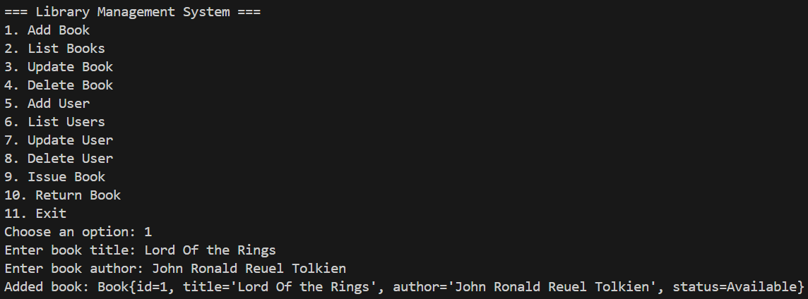
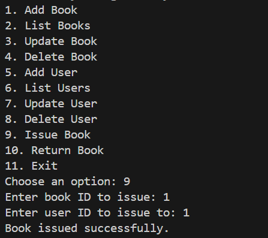
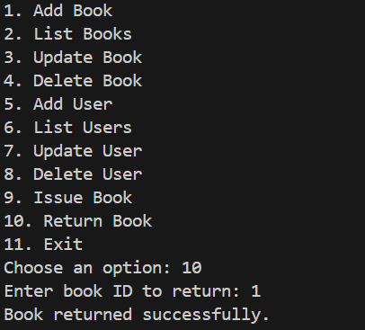

# Library Management System in Java

This is a command-line Java application designed to manage a library system. It allows users to perform basic CRUD operations (Create, Read, Update, Delete) on both books and users. All data is stored in plain text files in a human-readable format.

## Features

- Add, list, update, and delete books
- Add, list, update, and delete users
- Stores data in plain text files (`books.txt`, `users.txt`)
- Automatically loads and saves data on startup and shutdown
- Simple file-based persistence (no database required)

## How to Run

1. Clone or download this repository.

2. Compile the source files:

   ```bash
   javac *.java
3. Run the application:

   ```bash
   java Main

## Screenshots



